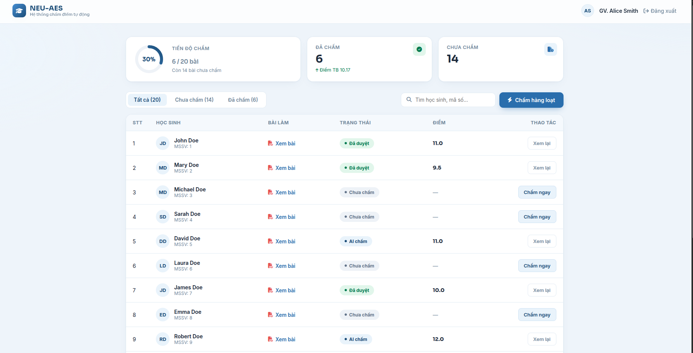
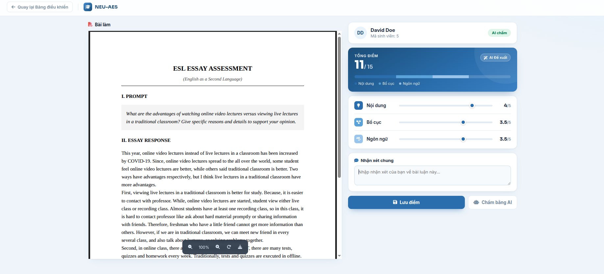

<div align="center">


# NEU-AES · Automated Essay Scoring

**Chấm điểm luận tiếng Anh tự động bằng AI — Nhanh · Chính xác · Nhất quán**

[](https://python.org)
[](https://fastapi.tiangolo.com)
[](https://pytorch.org)
[](LICENSE)

</div>

---

## Vấn đề

Chấm điểm luận (essay) là công việc **tốn thời gian nhất** của giáo viên tiếng Anh. Mỗi bài luận 300—500 từ cần **5—10 phút** để đọc, phân tích và cho điểm trên nhiều tiêu chí (nội dung, bố cục, ngôn ngữ). Với một lớp 40 sinh viên, giáo viên mất **3—6 giờ** chỉ để chấm một bài tập — chưa kể sự **thiếu nhất quán** giữa các lần chấm do mệt mỏi hay chủ quan.

## Giải pháp

**NEU-AES** là hệ thống chấm điểm tự động sử dụng mô hình ngôn ngữ lớn **(LLM Qwen3-4B)** kết hợp **XGBoost** để đánh giá bài luận theo 3 tiêu chí:

| Tiêu chí | Mô tả | Thang điểm |
|----------|-------|:----------:|
| **Nội dung** | Độ chính xác, chiều sâu lập luận, bám sát đề bài | 0–5 |
| **Bố cục** | Cấu trúc, tính mạch lạc, liên kết giữa các đoạn | 0–5 |
| **Ngôn ngữ** | Ngữ pháp, từ vựng, độ chính xác của diễn đạt | 0–5 |
| **Tổng** | | **0–15** |

### Điểm mạnh

- **⚡ Tiết kiệm 95% thời gian** — Chấm 40 bài trong vài phút thay vì hàng giờ
- **🎯 Nhất quán tuyệt đối** — Cùng một tiêu chuẩn cho mọi bài, không bị ảnh hưởng bởi mệt mỏi
- **🧠 AI có khả năng tự đánh giá** — Mô hình LLM sinh ra cả điểm "nghiêm khắc" và "dễ dãi", Judge model chọn điểm cân bằng nhất
- **👩‍🏫 Giáo viên vẫn là người quyết định** — AI đề xuất điểm, giáo viên có thể chỉnh sửa, thêm nhận xét và xác nhận
- **📄 Hỗ trợ PDF** — Mỗi bài luận được tự động tạo file PDF để xem trực tiếp

---

## Ảnh chụp màn hình

### Bảng điều khiển (Dashboard)



> *Theo dõi tiến độ chấm, lọc theo trạng thái, tìm kiếm sinh viên, chấm từng bài hoặc hàng loạt.*

### Chi tiết bài chấm



> *Xem bài làm dạng PDF, chỉnh sửa điểm bằng thanh trượt, thêm nhận xét và lưu kết quả.*

---

## Luồng trạng thái bài chấm

```
Chưa chấm ──▶ AI chấm ──▶ Đã duyệt
(unscored)   (ai_scored)  (reviewed)
```

| Trạng thái | Ý nghĩa |
|-----------|---------|
| 🔘 **Chưa chấm** | Bài mới, chưa qua xử lý |
| 🤖 **AI chấm** | AI đã chấm và đề xuất điểm |
| ✅ **Đã duyệt** | Giáo viên đã xác nhận / chỉnh sửa điểm |

---

## Công nghệ

| Thành phần | Công nghệ |
|-----------|-----------|
| Backend API | FastAPI + SQLAlchemy + SQLite |
| Frontend | HTML5 + CSS3 + Vanilla JavaScript |
| Mô hình chấm | Qwen3-4B (fine-tuned LoRA) |
| Model đánh giá | XGBoost Regressor |
| Auth | JWT (PyJWT) + bcrypt |
| PDF Generator | WeasyPrint |

---

## Cài đặt & Chạy

### Yêu cầu hệ thống

- **Python** 3.12+
- **CUDA** 13.0+ (nếu dùng GPU) hoặc CPU
- **RAM** ≥ 16GB (cho mô hình 4B tham số)
- **VRAM** ≥ 8GB (khuyến nghị 12GB)

### 1. Clone & cài đặt dependencies

```bash
git clone <repo-url>
cd Production

pip install -r requirements.txt
```

### 3. (Tùy chọn) Cấu hình môi trường

Tạo file `.env` từ mẫu (không bắt buộc — đã có mặc định):

```env
SECRET_KEY="your-secret-key-here"
ALGORITHM="HS256"
ACCESS_TOKEN_EXPIRE_MINUTES=30
```

Cơ sở dữ liệu `data/app.db` đã được seed sẵn với dữ liệu mẫu.

Tài khoản demo:

| Username | Password |
|----------|----------|
| `teacher_alice` | `pass123` |
| `teacher_bob` | `pass123` |

### 4. Khởi động server

```bash
uvicorn app.main:app --reload --host 0.0.0.0 --port 8000
```

Mở trình duyệt tại **[http://localhost:8000/login](http://localhost:8000/login)**.

---

## Cấu trúc dự án

```
Production/
├── app/
│   ├── main.py           # FastAPI app + toàn bộ endpoint
│   ├── ai_pipeline.py     # Pipeline chấm điểm (LLM + Judge)
│   └── routers/
│       └── auth.py        # Xác thực JWT
├── data/
│   ├── app.db              # SQLite database (đã seed sẵn)
│   ├── database.py         # Kết nối SQLite
│   └── model.py            # ORM models
├── templates/
│   ├── login.html
│   ├── dashboard.html
│   └── detail.html
├── weights/
│   └── judge.ubj          # Trọng số XGBoost Judge
├── assets/                # ← Chèn ảnh chụp màn hình vào đây
├── .env
├── requirements.txt
└── README.md
```

---

## API Endpoints

| Method | Path | Auth | Mô tả |
|--------|------|:----:|-------|
| `POST` | `/auth/token` | ✗ | Đăng nhập — trả về JWT |
| `GET` | `/login` | ✗ | Giao diện đăng nhập |
| `GET` | `/dashboard` | ✗ | Giao diện bảng điều khiển |
| `GET` | `/detail/{id}` | ✗ | Giao diện chi tiết bài chấm |
| `GET` | `/api/me` | ✓ | Thông tin giáo viên hiện tại |
| `GET` | `/api/dashboard` | ✓ | Stats + danh sách bài luận (phân trang, lọc, tìm kiếm) |
| `GET` | `/api/essays/{id}` | ✓ | Chi tiết bài luận + điểm + nhận xét |
| `GET` | `/api/essays/{id}/pdf` | ✓ | File PDF bài làm |
| `POST` | `/api/essays/{id}/grade` | ✓ | Lưu điểm + nhận xét của GV |
| `POST` | `/score_one` | ✓ | AI chấm 1 bài |
| `POST` | `/score_all` | ✓ | AI chấm hàng loạt |

---

<div align="center">
Made with ❤️ for EFL teachers everywhere
</div>
